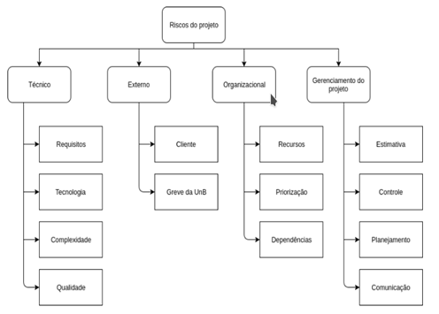

# Plano de Gerenciamento de Riscos

### Histórico de versão

| Data | Versão | Descrição | Autor |
|----------|----------|----------|----------|
| 29/08/18 | 0.1 | Início do Documento | Lucas Midlhey Cardoso Naves |
| 14/09/18 | 0.2 | detalhamento EAR e analise de riscos | Lucas Midlhey Cardoso Naves |
| 21/09/18 | 0.3 | Formatação e Descrição dos riscos | Shermam Tácia da Costa Lima |
| 02/10/18 | 0.4 | Adicão da Interpretação | Shermam Tácia da Costa Lima |
| 02/10/18 | 0.5 | Refatoração da identificação e definição de probabilidade e impacto de riscos | Shermam Tácia da Costa Lima, Filipe Barcelos e Igor Araújo |

### Sumário
1. Introdução
2. Objetivos
3. Indentificação dos riscos
4. Estrutura Analitica dos riscos
5. Analíse de riscos
6. Indentificação dos Riscos
6. Definição de probabilidade e impactos de riscos
7. Interpretação
8. Definição de Probabilidades e Impactos de Riscos
9. Matriz de Probabilidade e Impacto
10. Bibliografia

## 1. Introdução	
O Plano de gerenciamento de riscos tem como objetivo perceber e tratar pequenos riscos a fim de que não cresçam e possam preocupar o projeto. Risco é o efeito (positivo ou negativo) de um evento ou de uma série de eventos que se manifesta em um ou em vários locais. Ele é calculado a partir da probabilidade deste evento se manifestar e do impacto que ele poderia causar. Alguns elementos devem ser identificados para se analisar riscos, incluindo um evento, o que pode acontecer, probabilidade, com que frequência ele pode acontecer, impacto, o quão ruim ele pode ser, mitigação, como pode ser reduzido, contingência e como pode-se reduzir o impacto.

## 2. Objetivos

O objetivo desse artefato é documentar os riscos associados ao projeto, bem como as ações a serem tomadas para que eles sejam mitigados ou contornados.

## 3. Identificação dos Riscos

A identificação dos riscos é evento incerto que deve ser gerenciado para que se tenha um controle de todos os incidentes que podem acontecer. Observar os riscos promove um projeto mais seguro garantindo a eficiência do negócio e diminuindo problemas durante o processo.
Como o projeto é dividido em várias áreas, o processo de identificação de erros é contínuo, assim, é necessário prevê-los antes da etapa de desenvolvimento.
Podemos encarar a identificação de riscos de duas maneiras: positivo ou negativo. Como é um evento futuro, conseguimos gerenciá-los, diferente de problemas em que a única forma de se resolver é a contingência.

## 4. Estrutura analítica de Riscos

Trata-se de um mapeamento antecipado dos riscos do projeto e tem como objetivo auxiliar a compreensão e apresentação dos riscos de um projeto de forma estruturada,de modo que, é bem similar a uma Estrutura Analítica de Projeto(EAP), onde, quanto mais abaixo o nível do risco maior o seu nível de detalhamento.

 

[ver imagem em tamanho original](https://fga-eps-mds.github.io/2018.2-NaturalSearch/docs/images/Riscos_NaturalSearch.png)
 

### Técnico

| Tipo | Descrição |
| -----------| -----------|
| Requisitos | Riscos pela falta de mapeamento e elicitação de requisitos |
| Tecnologias | Riscos gerados pela tecnologia usada |
| Complexidade | Riscos gerados pela falta de conhecimento |
| Qualidade | Riscos decorrentes da qualidade do produto final |

### Externos

| Tipo | Descrição |
| -----------| -----------|
| Cliente | riscos gerados pelo cliente em relação ao produto |
| Greve na UnB | Risco gerado pela paralização de atividades na UnB |

### Organizacional

| Tipo | Descrição |
| -----------| -----------|
| Recursos | Riscos gerados pela falta de material humano e/ou tecnológico |
| Priorização | Riscos gerados pela má escolha de histórias na Sprint |
| Dependências | Riscos que podem afetar a evolução do projeto |

### Gerenciamento do Projeto

| Tipo | Descrição |
| -----------| -----------|
| Estimativa | Riscos que podem afetar o tempo de produção do projeto |
| Controle | Riscos relacionados ao controle de atividades |
| Planejamento | Riscos relacionados ao planejamento de confecção do projeto |
| Comunicação | Riscos relacionados às atividades e meio de comunicação |

## 5. Análise de Riscos

Análise de risco contém três pilares conceituais, o futuro, a escolha e a mudança. Desta forma, sempre estarão em evidência o futuro pelo qual o risco poderá afetar o projeto quando não se sai como esperado, a escolha, ou seja, que método devemos escolher, o tamanho de equipe, delegação de afazeres no projeto e qual será a ênfase da qualidade do software, de modo que, a mudança acarreta principalmente quando influencia os requisitos do sistema e tecnologias de desenvolvimento.

## 6. Identificação dos Riscos

| ID | Se | por conta | o impacto será | Categoria EAR |
| --------- |--------- |--------- |--------- |--------- |
| RN01 | Cliente mudar o escopo | de definição da disciplina | replanejamento do projeto | Comunicação |
| RN02 | Um membro desistir da disciplina |	de motivos diversos | enfraquecimento no desempenho da equipe, sobrecarga de atividades para os membros remanescentes e realocação de atividades | Recursos |
| RN03 | Um membro da equipe ficar ausente | de motivos diversos | enfraquecimento temporário no desempenho da equipe e sobrecarga de atividades para os membros remanescentes e realocação de atividades | Recursos |
| RN04 | Houver problemas na comunicação da equipe | do número de membros | dificuldade no gerenciamento por Parte do Scrum Master, falta de compreensão absoluta das atividades a serem realizadas e possibilidade de atraso nas entregas das histórias | comunicação |
| RN05 | As atividades não forem concretizadas no prazo | da falta de integração da equipe de desenvolvimento | atraso na baseline do projeto | Estimativas |
| RN06 | Houverem perdas de equipamentos | de diversos motivos | atraso na entrega das histórias e possibilidade de membro inativo | Recursos |
| RN07 | O arquiteto não conseguir planejar e garantir a execução da arquitetura | falta de conhecimento das tecnologias do projeto | dificuldade na organização e atraso no desenvolvimento | Tecnologia |
| RN08 | O desenvolvedor não tiver domínio da tecnologia | da falta de empenho | atraso no desenvolvimento e sobrecarga de outros membros da equipe | Tecnologia |
| RN09 | Houver baixa produtividade da equipe | da falta de empenho dos membros de desenvolvimento | atraso no cronograma de entrega do produto |Tecnologia |
| RN10 | A equipe não se adaptar a tecnologia de comunicação | da dificuldade de utilização da(s) ferramenta(s) | dificuldade no gerenciamento da equipe por parte do Scrum Master e falta visão única em relação ao escopo do produto | Comunicação |
| RN11 | Houver mudança na Arquitetura do projeto | de inviabilidade tecnológica | atraso na entrega, redefinição da Arquitetura, replanejamento do cronograma, redefinição do Documento de Arquitetura e necessidade de adaptação a nova tecnologia | tecnologia |
| RN12 | Houverem dificuldades em realizar os testes | da falta de conhecimento | atraso na entrega das histórias planejadas | Estimativa |
| RN13 | Houver o cancelamento do projeto | de falta de interresse do cliente | interrupação do projeto | Cliente |
| RN14 | A qualidade do software não corresponder às expectativas do cliente | Má implementação | Descontetamento do Cliente e possibilidade de cancelamento do projeto | Cliente |
| RN15 | A equipe não conseguir acessar os dados da API Salic | de indisponibilidade na internet | atraso na entrega das histórias | Estimativa |
| RN16 | A equipe não conseguir acessar os dados da API Salic | de indisponibilidade da API | atraso na entrega das histórias | Estimativa |
| RN17 | O DevOps não conseguir automatizar o deploy e a integração contínua | de falta de conhecimento | atraso na entrega do produto em ambiente de produção | Estimativa |
| RN18 | O DevOps não conseguir automatizar o deploy e a integração contínua | de indefinição da Arquitetura do projeto | atraso na entrega do produto em ambiente de produção | Estimativa |
| RN19 | Houver histórias de usuário mal definidas | de falta elicitação de requisitos de forma adequada | atraso na entrega do produto e necessidade de redefinição das histórias | Estimativa |
| RN20 | Houver Sprint mal planejada | de histórias mal planejadas | atraso na entrega do produto, dificuldade na compreensão das histórias e necessidade de replanejamento | Estimativa |

## 7. Interpretação

| ID | Impacto | Probabilidade | Prioridade | Contigência| Mitigação |
|----|----|----|----|----|----|
| RN01 | Muito Alto | Baixa | Média | Redefinir o quanto antes as mudanças de escopo  | Manter sempre a comunicação com o cliente |
| RN02 | Muito Alto | Média | Média | Realocar  as tarefas entre os membros remanescentes | Conversar com os membros da equipe, e  oferecer suporte em questões relacionadas ao projeto, outras disciplinas e no que mais for possível |
| RN03 | Alto | Muito Alta | Muito Alta | Realocar as tarefas entre os membros presentes | Conversar com a equipe a fim de reafirmar a importância do projeto para que a equipe o priorize |
| RN04 | Muito Alto | Alta | Alta | Reafirmar a necessidade de um alto grau de comunicação e promover as mudançãs necessárias, desde realização de daily meetings mais objetivas a mudanças de ferramentas para comunicação | Criando o Plano de comunicação em que a equipe demonstre comum acordo |
| RN05 | Muito Alto | Muito Alta | Alta | Realizar a entrega na próxima Sprint como dívida técnica e, talvez, realocá-la para uma dupla com mais facilidade com a tecnologia | Planejar as atividades e dividi-las nas sprints com base nos pesos e dificuldade definida no planning poker |
| RN06 | Alto | Média | Média | O membro trabalhar nos equipamentos da Universidade e/ou realizar o pareamento como co-piloto | - |
| RN07 | Muito Alto | Alta | Muito Alta | Realizar a mudança na Arquitetura do projeto buscando outras tecnologias capazes de solucionar os problemas ocorridos | Buscar conhecimento com outros alunos, professores, pessoas de fora da comunidade universitária, novas pesquisas e/ou cogitar a mudança de tecnologias |
| RN08 | Alto | Alta | Muito Alta | Realizar pareamentos alocando os membros com mais conhecimento com os que possuem mais dificuldades | Aprendizagem de linguagem por meio de treinamentos entre os membros da equipe e pesquisas para aprendizado |
| RN09 | Muito Alto | Média | Alta | Promover uma maior integração entre os membros da equipe visando a ajuda mútua | Mantendo comunicação com a equipe, e verificando as dificuldades para tentar minimiza-las |
| RN10 | Muito Alto | Média | Alta | Promover as mudanças necessárias de ferramentas o quanto antes | Pesquisar ao máximo as possibilidades de tecnologias a fim de selecionar a que seja mais compatível com a solução planejada |
| RN11 | Muito Alto | Alta | Muito Alta | Definir a nova arquitetura e repassar para a equipe de forma detalhada | Verificar as tecnologias definidas de modo a garantir a viabilidade e compatibilidade com a solução planejada | 
| RN12 | Muito Alto | Alta | Muito Alta | Promover novos treinamentos de testes entre os membros da equipe, a fim de transmitir o conhecimento de forma mais ampla | Treinamento de como realizar os testes para as tecnologias definidas |
| RN13 | Muito Alto | Muito Alta | Muito Alta | Oferecer a melhor possibilidade de produto para o cliente | Manter comunicação constante com o cliente |
| RN14 | Muito Alto | Muito Alta | Muito Alta | Realizar refatoração de código, testes e validação com o cliente | Realizar treinamentos de todas as tecnologias utilizadas, garantir a realização de testes, boas práticas de programação e validação com o cliente |
| RN15 | Alto | Muito Alta | Muito Alta | - | - |
| RN16 | Alto | Muito Alta | Muito Alta | - | - |
| RN17 | Alto | Alta | Alta | Procurar ajuda de alunos, professores, pessoas de fora do ambiente universitário e aumentar a carga de estudos | Realização de pesquisas constantes e consultoria com outros alunos, professores e pessoas de fora do ambiente universitário |
| RN18 | Alto | Alta | Alta | Procurar ajuda de alunos, professores, pessoas de fora do ambiente universitário e aumentar a carga de estudos, por parte do Arquiteto | Realização de pesquisas constantes e consultoria com outros alunos, professores e pessoas de fora do ambiente universitário, por parte do Arquiteto |
| RN19 | Alto | Muito Alta | Alta | Realizar um replanejamento das histórias para que entrem em conformidade com os requisitos | Realizar constantes reuniões entre os membros da equipe, com o cliente e pesquisas necessárias para obtenção de conhecimento e compreensão sobre o escopo do projeto |
| RN20 | Alto | Alta | Alta | Realizar replanejamento da sprint utilizando a priorização do backlog do produto | Montar o backlog da sprint utilizando a priorização do backlog do produto |

## 8. Definição de Probabilidades e Impactos de Riscos

A tabela abaixo define os intervalos para o peso de cada risco listado.

| Probabilidade | Intervalo | Peso |
|-----|-----|-----|
| Muito baixa | 1% - 20% | 1 |
| Baixa | 21% - 40% | 2 |
| Média | 41% - 60% | 3 |
| Alta | 61% - 80% | 4 |
| Muito Alta | 81% - 100% | 5 |

 

## 9. Matriz de Probabilidade e Impacto

| Probabilidade/Impacto | Muito Baixo | Baixo | Médio | Alto | Muito Alto |
|----|----|----|----|----|----|
| Muito Baixa | 1 | 2 | 3 | 4 | 5 |
| Baixa | 2 | 4 | 6 | 8 | 10 |
| Média | 3 | 6 | 9 | 12 | 15 |
| Alta | 4 | 8 | 12 | 16 | 20 |
| Muito Alta | 5 | 10 | 15 | 20 | 25 |

 
 
Com base na Matriz elaborada é possível definir a faixa de peso para as prioridades.

| Prioridade | Peso |
|-----|-----|
| Muito Baixa | 1 - 5 |
| Baixa | 6 - 10 |
| Média | 11 - 15 |
| Alta | 16 - 20 |
| Muito Alta | 21 -25 |

## Bibliografia
HILLSON, D. The risk breakdown structure (RBS) as an aid to effective risk management. Fifth European Project Management Conference. Cannes. 2002
PRESSMAN, Roger S. – “ Engenharia de Software ” - Makron Books do Brasil Editora Ltda

