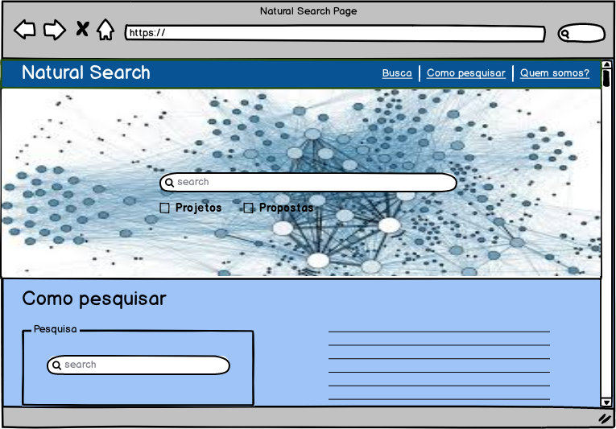
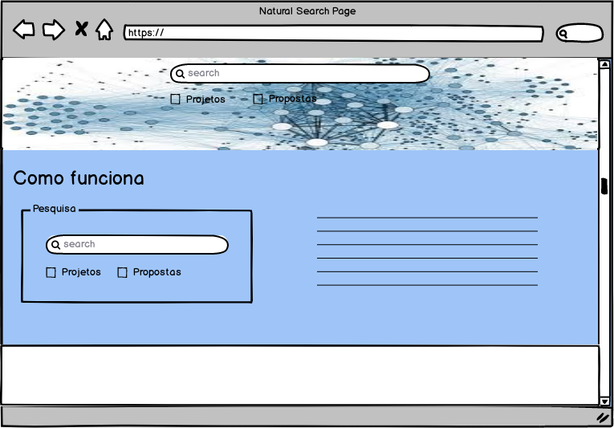
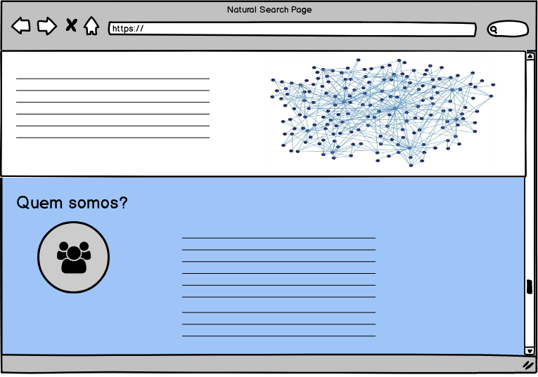
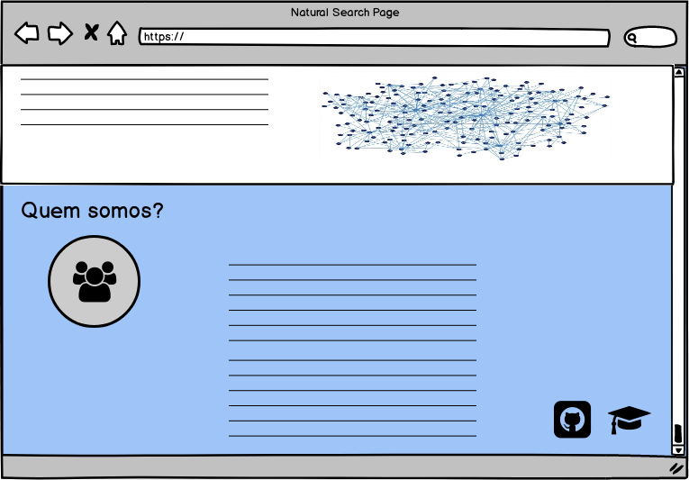
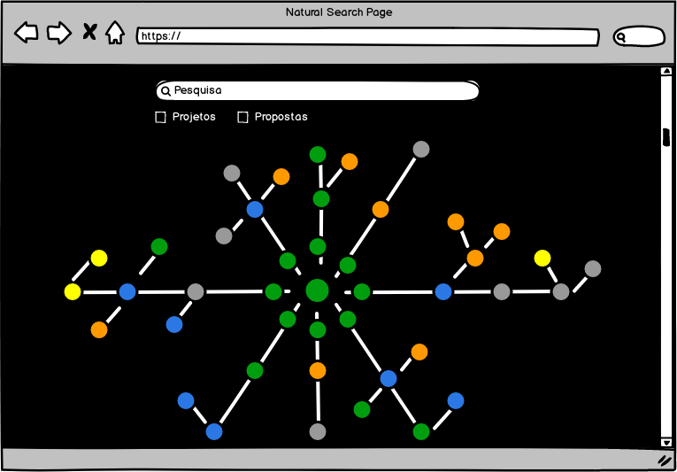
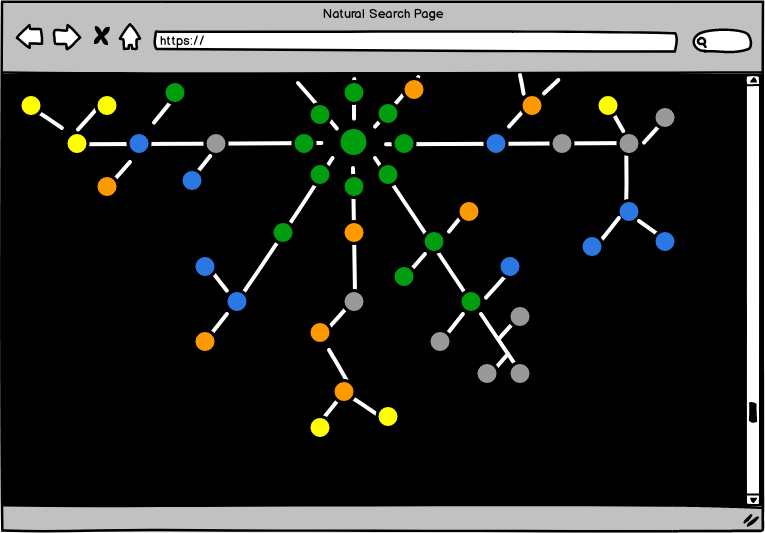

# Protótipo de baixa fidelidade

|           Data          |         Versão         |       Descrição   |         Autores   |
|:----------------------:|:------------------------:|:---------------------:|:--------------:|
| 04/09/2018         |           0.1                | Versão inicial do Protótipo de Baixa Fidelidade |  [Adrielly Rodrigues de Jesus](https://github.com/drykette), [Fabiana Luiza V. P. Ribas](https://github.com/FabianaRibas), [Gustavo Duarte Moreira](https://github.com/gustavoduartemoreira), [Marcos Vinícius Rodrigues da Conceição](https://github.com/marcos-mv), [Michel Martins de Camargo](https://github.com/micheldcamargo), [Mikhaelle de Carvalho Bueno](https://github.com/Mikhaelle); |

 
 
 

 

 

 

 

 

 
