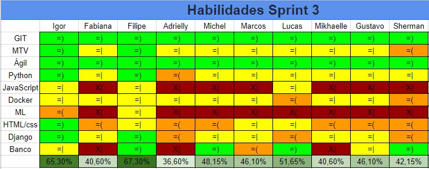

---
---

# Planejamento da Sprint 4

## 1. Dados da Sprint 4

| Início | Término | Duração | Pontos Planejados | Pontos Dívida Técnica | Pontuação Total |
|----------|----------|----------|----------|----------|----------|
| 24/09/2018 | 29/09/2018 | 6 dias | 40 | 0 | 40 |

## 2. Papéis 
| Papel | Responsável |
|---|---|
| Shermam Lima | Scrum Master |
| Filipe Barcelos e Igor Sousa | Product Owner |
| Filipe Barcelos | Arquiteto |
| Igor Sousa | Devops |
| Mikhaelle Bueno, Adrielly Jesus, Marcos Conceição, Fabiana Ribas, Gustavo Moreira, Michel Camargo | Desenvolvedores |

## 3. Planejamento da Sprint 4

O planejamento da Sprint 4, é iniciado com algumas alterações na arquitetura, para isso é aplicado algumas historias técnicas.

## 4. Pareamento 

| Membro  | Membro |
|---|---|
| Igor Sousa  | Felipe Barcelos |
| Mikhaelle Bueno | Fabiana Ribas |
| Gustavo Moreira | Adrielly Jesus |
| Marcos Conceição | Michel Camargo |
| Shermam Tácia | - |

## 5. Quadro de Conhecimento 
O quadro de conhecimento inicia com a imagem apresentada abaixo:

 
 
 

[ver imagem em tamanho original](https://fga-eps-mds.github.io/2018.2-NaturalSearch/docs/resultado_sprint/image_Sprint3/Legenda.png)

 
 
 

[ver imagem em tamanho original](https://fga-eps-mds.github.io/2018.2-NaturalSearch/docs/resultado_sprint/image_Sprint3/Habilidade_Sprint_3.png)

 
 
 

## 4. Objetivos Sprint4

* Refatorar EAP e EVM
* Refatorar Documento de Visão
* Refatorar Documento de Arquitetura
* Criar o RoodMap dos Pepeis
* Backlog do Produto
* Identidade Visual
* ROI
* Indicadores de Métricas

## 5. Backlog da Sprint
* [TS02](https://github.com/fga-eps-mds/2018.2-NaturalSearch/issues/99)-Eu, como desenvolvedor, desejo consumir os dados de projetos e propostas utilizando o Node.js.
* [TS03](https://github.com/fga-eps-mds/2018.2-NaturalSearch/issues/10)-Eu, como desenvolvedor, desejo realizar pesquisas no banco de dados utilizando o Node.js

## 6. Riscos da Sprint
Nessa Sprint, foi assumido o risco da mudança da arquitetura, mudança do Django para Django Rest, e inclusão do Node.js sendo este um interpretador de código JavaScript com o código aberto, focado em migrar o Javascript do lado do cliente para servidores. Essa Sprint pode impactar em os desenvolvedores não conseguirem realizar as historias, por falta de conhecimento e treinamento.

