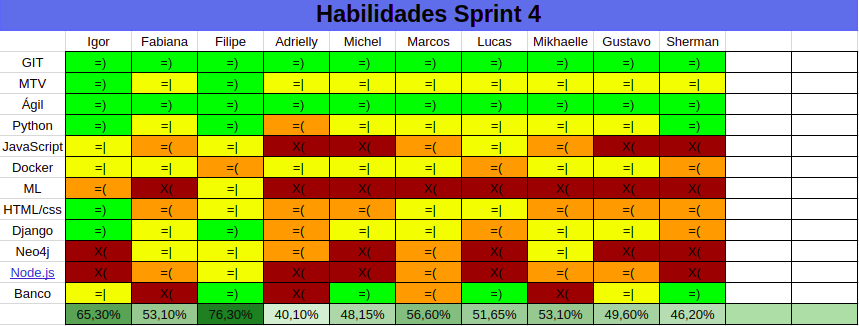

---
---

# Planejamento da Sprint 5

## 1. Dados da Sprint 

| Início | Término | Duração | Pontos Planejados | Pontos Dívida Técnica | Pontuação Total |
|----------|----------|----------|----------|----------|----------|
| 08/10/2018 | 13/10/2018 | 6 dias | 34 | 8 | 42 |

## 2. Papéis 

|    Papel |     Responsável |
|-----|-----|
| Shermam Lima | Arquiteta |
| Filipe Barcelos e Igor Sousa | Product Owner |
| Filipe Barcelos | Scrum Master |
| Igor Sousa | Devops |
| Mikhaelle Bueno, Marcos Conceição, Fabiana Ribas, Gustavo Moreira, Michel Camargo | Desenvolvedores |

## 3. Planejamento da Sprint

O planejamento da Sprint 5 tem como  objetivo explicitar as histórias de usuário selecionadas para o desenvolvimento. 

## 4. Pareamento 

| Membro  | Membro |
|---|---|
| Igor Sousa  | Michel Camargo |
| Mikhaelle Bueno | Marcos Conceição |
| Gustavo Moreira | Shermam Tácia |
| Filipe Barcelos | Fabiana Ribas |

## 5. Quadro de Conhecimento 
O quadro de conhecimento se inicia com a imagem apresentada abaixo:

 

[ver imagem em tamanho original](https://fga-eps-mds.github.io/2018.2-NaturalSearch/docs/resultado_sprint/image_Sprint3/Legenda.png)

 

[ver imagem em tamanho original](https://fga-eps-mds.github.io/2018.2-NaturalSearch/docs/images/sprint_4.png)

 

## 6. Objetivos Sprint

* consumir dados de Proponentes 
* remover informações desnecessárias de projetos
* remover informações desnecessárias de proponentes
* realizar pesquisa 
* criar tela de resultados 

## 7. Backlog da Sprint

- [US08](https://github.com/fga-eps-mds/2018.2-NaturalSearch/issues/119)
- [US09](https://github.com/fga-eps-mds/2018.2-NaturalSearch/issues/120)
- [US10](https://github.com/fga-eps-mds/2018.2-NaturalSearch/issues/121)
- [US11](https://github.com/fga-eps-mds/2018.2-NaturalSearch/issues/122)
- [TS03](https://github.com/fga-eps-mds/2018.2-NaturalSearch/issues/100)

## 8. Riscos da Sprint

Os riscos que podem ser mais relevantes ao longo dessa sprint são:

* Um membro da equipe ficar ausente
* Houver problemas na comunicação da equipe
* As atividades não forem concretizadas no prazo
* O desenvolvedor não tiver domínio da tecnologia

