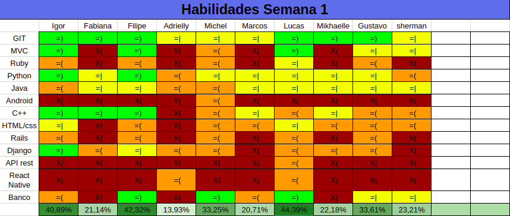
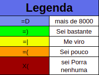

# Resultados da primeira semana

## 1. Resumo da Primeira Semana

__Pontos concluídos__: 0 pontos,pois ainda não havíamos definidos histórias de usuários

- Resultados:
   - Conhecer Todos os integrantes do grupo
   - [Dar treinamento de Banco](https://github.com/fga-eps-mds/2018.2-NaturalSearch/issues/3)
   - [Dar treinamento de Docker](https://github.com/fga-eps-mds/2018.2-NaturalSearch/issues/2)
   - [Dar treinamento Metodologia Ágil](https://github.com/fga-eps-mds/2018.2-NaturalSearch/issues/4)
   - [Dojo de git](https://github.com/fga-eps-mds/2018.2-NaturalSearch/issues/1)
   - [elaboração do quadro de cinhecimento](https://github.com/fga-eps-mds/2018.2-NaturalSearch/issues/5)

Conforme pode ser observado acima, todos os objetivos previstos para esta primeira semana foram entregues. Devido à baixa complexidade dos objetivos dessa semana,sendo a maioria relacionado com ferramentas e conceitos básicos para qualquer engenheiro de software.

## 2. Retrospectiva da Primeira Semana

| Pontos Positivos | Pontos Negativos | Sugestão de Melhoria |
| ----- | ----- | ---- |
| Boa comunicação entre a equipe | Falta de local para executarmos os primeiros dojos,pois não tínhamos feito reservas para as salas na FGA | Tentar fazer remotamente ou tentar reservar a sala previamente. |
|Os treinamentos foram ministrados de forma dinâmica,fazendo assim com que todos interagem e tentassem entender o assunto ministrado.  |A grande quantidade de informações que tanto MDS quanto EPS tiveram que aprender em um curto período de tempo | Estudar e entender de forma comprometida todas as ferramentas,metodologias,papéis e termos para melhorar o nível de conhecimento da equipe |
Comunicação entre MDS e EPS foi feita de forma rápida e fluida | - | - |

## 3. Quadro de Conhecimento

### Quadro de conhecimento:

### Legenda do quadro de conhecimento:

### Duplas de pareamento: 

## 4. Análise do Scrum Master

Esta primeira semana foi utilizada para termos um primeiro contato com os nossos MDS para conhecer um pouco da personalidade de cada um,ao conhecê-los foram feitas algumas perguntas para ele: O semestre,o que gostam de fazer no tempo livre e por quê de escolherem engenharia de software,para entendermos sobre a situação de cada um em relação ao curso e iniciarmos uma comunicação amigável com eles.

Na parte relacionada aos treinamentos foi feito de forma bem descontraída para que eles conseguissem entender o que estava sendo passado para eles sem que ficassem saturados,já que foram ministrados 4 treinamentos em apenas um dia.
