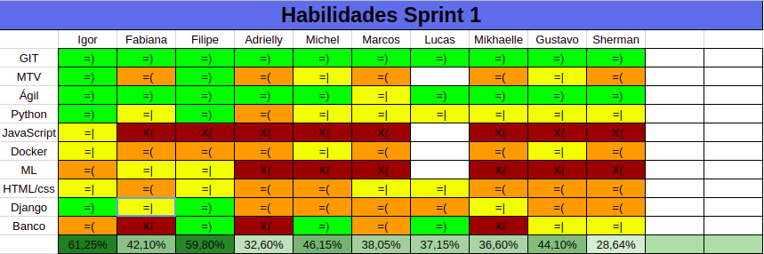
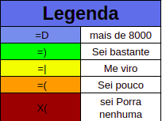
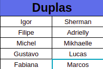

# Resultados da primeira semana

## 1. Resumo da Primeira Semana

__Pontos concluídos__: 0 pontos,pois ainda não havíamos definidos histórias de usuários

- Resultados da Sprint:
 - [Produzir protótipo de baixa fidalidade](https://github.com/fga-eps-mds/2018.2-NaturalSearch/issues/59)
 - [Continuação do Documento de Visão](https://github.com/fga-eps-mds/2018.2-NaturalSearch/issues/36)
 - [Primeira versão do Documento de Arquitetura](https://github.com/fga-eps-mds/2018.2-NaturalSearch/issues/52)
 - [Configuração da Integração Continua com o CircleCI](https://github.com/fga-eps-mds/2018.2-NaturalSearch/issues/25)
- [Definição das User Stories](https://github.com/fga-eps-mds/2018.2-NaturalSearch/issues/62)
 
 Grande parte do que foi planejado, ao início da Sprint, foi entregue e até mais, como a integração contínua com o CircleCI.

## 2. Retrospectiva da Primeira Semana

| Pontos Positivos | Pontos Negativos | Sugestão de Melhoria |
| ----- | ----- | ---- |
| A equipe possui uma boa comunicação  | MDS teve uma pequena crítica a comunicação sobre a documentação que GPP,pois eles querem ter uma visão geral de todos os documentos,tanto de MDS quanto de GPP | Inserir um bot no telegram para que todos saibam o que cada um está entregando de forma fácil e rápida |
|Deu para perceber que a maioria dos membros da equipe está se dedicando para fazer as datas de entregas sejam cumpridas|Ainda possui uma pequena parcela dos integrantes que não está com o mesmo empenho que o resto da equipe. | Tentar fazer com que todas os integrantes tenham uma visão da importância de fazer com que as entregas cumpram a data definida.|
## 3. Quadro de Conhecimento

### Quadro de conhecimento:

### Legenda do quadro de conhecimento:

### Duplas de pareamento:

Como já temos uma visão  mais clara sobre o projeto que irá ser desenvolvido delimitamos mais as ferramentas e linguagens que serão necessárias para o total desenvolvimento do projeto,fazendo assim com que fique mais fácil perceber o desenvolvimento da equipe a cada Sprint.

## 4. Análise do Scrum Master

Essa Sprint foi extremamente focada em tentarmos entender o nosso projeto como um todo, pois ainda haviam algumas lacunas sobre como o projeto seria desenvolvido e qual o problema que estávamos tentando resolver ao propor a aplicação.O Pitch feito em sala de aula foi algo que nos ajudou muito a definir tudo que estava obscuro dentro do projeto.A falta de alguns membros nas dailys foi outro fator que chamou a atenção nessa Sprint onde foi necessário uma conversa com toda a equipe para que entendam a importância da daily.

