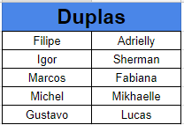

# Resultados da Sprint 2

## 1. Resumo da Sprint 2

__Pontos concluídos__: 14 pontos 

## 2. Retrospectiva da Sprint 2

Conclusão da primeira versão do Documento de arquitetura (Não entregue)

Finalização do protótipo de baixa fidelidade e inicio do protótipode alta fidelidade (entregue)

Desenvolvimento do EVM e EAP (entregue)

Definição de pronto (não entregue)

Refatorar planejamento de Sprint e Resultados (não entregue)

Elaborar Planejamento de Riscos (não entregue)

Finalizar RoadMap (não entregue)

#### User Historias

Não foram entregues duas historias, Eu, como usuário, desejo realizar uma pesquisa com qualquer palavra, frase, ou número que interessar e Eu, como desenvolvedor, desejo criar a tela de visualização dos resultados da pesquisa por meio de grafos.

#### Pontos a Melhorar 
Melhor gerenciamento das daily meetings.
## 3. Quadro de Conhecimento

### Quadro de conhecimento:

[ver imagem em tamanho original](https://fga-eps-mds.github.io/2018.2-NaturalSearch/docs/resultado_sprint/image_Sprint3/Habilidade_Sprint_2.png)

### Legenda do quadro de conhecimento:

### Duplas de pareamento:

Como já temos uma visão  mais clara sobre o projeto que irá ser desenvolvido delimitamos mais as ferramentas e linguagens que serão necessárias para o total desenvolvimento do projeto,fazendo assim com que fique mais fácil perceber o desenvolvimento da equipe a cada Sprint.

## 4. Análise do Scrum Master

Essa Sprint foi extremamente assumida alguns riscos, tais como de um membro se afastar do projeto, por conta de uma viagem, e ficando a desejar em alguns documentos, atrasando o projeto, e não realizando seu papel, de monitoramento e controle da equipe.

Realizar pesquisa não foi entregue devido a dificuldade técnica da dupla por nunca terem realizado nenhuma aplicação em django.

Criar tela de visualização não foi entregue devido a dificuldade técnica da dupla em relação a biblioteca arbor js e a possível mudança de biblioteca para construção de grafos e adaptação para receber os diversos resultados do banco de dados orientado a grafos.

A documentação do Scrum Master não foi entregue devido a falta de comprometimento

