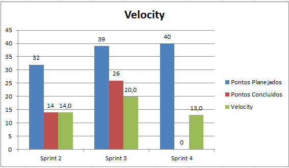
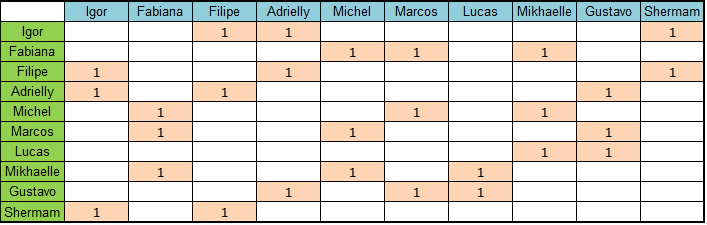

# Resuldado da Sprint 5

## Informações Básicas

| Sprint | Início | Término | Duração | Pontuação Total | Pontuação concluída |
|---|---|---|---|---|---|
| 4 | 08/10/2018 | 13/10/2019 | 6 dias | 42 | 42 |

### Presença na Sprint Review e Retroscpective

| Membro | Presença |
|---|---|
|Filipe Coelho Hilário Barcelos| ok |
|Igor Araújo de Sousa | ok |
|Shermam Tácia da Costa Lima | &#x2718; |
|Mikhaelle de Carvalho Bueno | ok |
|Marcos Vinícius Rodrigues da Conceição | ok |
|Fabiana Luiza V. P. Ribas | ok |
|Gustavo Duarte Moreira | ok |
|Michel Martins de Camargo| &#x2718; |

### Papéis 

|Papel | Responsável |
|---|---|
| Shermam Lima | Arquiteta |
| Filipe Barcelos e Igor Sousa | Product Owner |
| Filipe Barcelos | Scrum Master |
| Igor Sousa | Devops |
| Mikhaelle Bueno, Adrielly Jesus, Marcos Conceição, Fabiana Ribas, Gustavo Moreira, Michel Camargo | Desenvolvedores |

### Sprint Backlog

| Issue | Descrição | Pontos | Status | Motivo |
|---|---|---|---|---|
| [TS02](https://github.com/fga-eps-mds/2018.2-NaturalSearch/issues/99) | Eu, como desenvolvedor, desejo consumir os dados de projetos e propostas utilizando o Node.js | 20 | Pendente | - |
| [TS03](https://github.com/fga-eps-mds/2018.2-NaturalSearch/issues/10) | Eu, como desenvolvedor, desejo realizar pesquisas no banco de dados utilizando o Node.js | 20 | Pendente | - |

## Pareamento 

| Membro  | Membro |
|---|---|
| Igor Sousa  | Felipe Barcelos |
| Mikhaelle Bueno | Fabiana Ribas |
| Gustavo Moreira | Adrielly Jesus |
| Marcos Conceição | Michel Camargo |
| Shermam Tácia | - |

## Monitoramento e Controle da Sprint 

| Membros | 08/10 | 09/10 | 10/10 |11/10 | 12/10 | 13/10 |
|---|---|---|---|---|---|---|
|Filipe Coelho Hilário Barcelos| &#10004; | &#10004; | &#10004;| &#10004; | &#10004; | &#10004; |
|Igor Araújo de Sousa | &#x2718;| &#10004; | &#10004; | &#10004; | &#10004; | &#10004; |
|Shermam Tácia da Costa Lima | &#10004; | &#10004; | &#10004; | &#x2718; | &#10004; | &#x2718; |
|Mikhaelle de Carvalho Bueno | &#10004; | &#10004; | &#10004; | &#x2718; | &#10004; | &#10004; |
|Marcos Vinícius Rodrigues da Conceição | &#10004; | &#10004; | &#10004; | &#10004; | &#10004; | &#10004; |
|Fabiana Luiza V. P. Ribas | &#x2718; | &#x2718; | &#10004; | &#10004; | &#10004; | &#10004; |
|Gustavo Duarte Moreira | &#10004; | &#10004; | &#10004; | &#10004; | &#10004; | &#10004; |
|Michel Martins de Camargo| &#10004; | &#10004; | &#10004;| &#x2718; | &#x2718;| &#x2718;|

## Retrospectiva da Sprint

### Pontos Positivos

- Maior aprendizado e facilidade para a implementação da história.
- Maioria dos pontos planejados entregues.
- Boa comunicação da equipe.
- Entrega da história de usuário e facilidade de pareamento.
- Oportunidade de aprendizado sobre front-end.
- Alta produtividade.

### Pontos Negativos

- Falta de presença da maior parte da equipe nas reuniões com as professoras para definição do escopo.
- Dificuldade de planejamento de horário para pareamento.
- Evasão nas _daily meetings_ e na reunião de retrospectiva. 

### Melhorias 

- Melhorar participação nas _daily meetings_ e na reunião de retrospectiva.

## Métricas

### Velocity

O velocity desta semana é apresentado :

 

[ver imagem em tamanho original](https://fga-eps-mds.github.io/2018.2-NaturalSearch/docs/resultado_sprint/image_Sprint4/velocity_Sprint_4.png)

 

### Pareamentos
A imagem mostra a quantidade de pareamentos e com qual membro da equipe:
 

[ver imagem em tamanho original](https://fga-eps-mds.github.io/2018.2-NaturalSearch/docs/resultado_sprint/image_Sprint4/Pareamento_4.png)

 

## Análise do Scrum Master
Nesta Sprint, foi bastante complexa, pelo fato da mudança da arquitetura, como consequência houve a necessidade de aprendizagem de novas tecnologias para implementar as historias, aprendizado de Node.js e Neo4j e D3.
Houve alguns problemas para a execução das historias, devido a dependencia da API Salic está indisponivel, atrasando então a execução da historia. Houve alguns documentos que não foram finalizados, pelo fato das historias demandarem bastante tempo.
